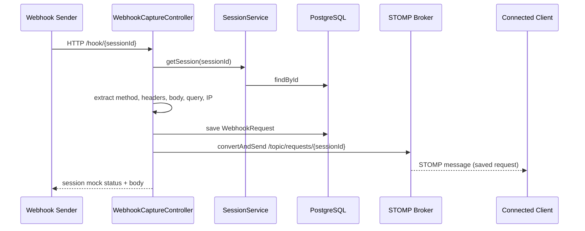

# Webhook Debugger — Backend

## Overview

This is the Spring Boot backend for **Webhook Debugger**, a tool for creating temporary webhook endpoints, capturing inbound HTTP traffic, streaming new requests to connected clients in real time, replaying captured requests to arbitrary URLs, and returning configurable mock responses to webhook senders. It powers the companion frontend at [webhook-debugger-frontend](https://github.com/sravanidasari4488/webhook-debugger-frontend.git).

---

## Architecture

A webhook request flows through the backend as follows:

1. **Ingestion** — An external sender hits `/{hook}/{sessionId}` (mapped as `/hook/{sessionId}`). `WebhookCaptureController` validates that the session exists and has not expired, then reads the HTTP method, headers, body, query parameters, and source IP.
2. **Persistence** — The request is serialized (headers and query params to JSON strings) and saved as a `WebhookRequest` row in PostgreSQL via `WebhookRequestRepository`.
3. **Cache invalidation** — The `sessionRequests` Redis cache entry for that session is evicted so the next list read reflects the new request.
4. **Broadcast** — After save, `SimpMessagingTemplate.convertAndSend` publishes the saved entity to `/topic/requests/{sessionId}`.
5. **Mock response** — The controller returns an HTTP response using the session's `customResponseStatus` and `customResponseBody` (not per-request overrides).

Read-heavy lookups (`SessionService.getSession`, `SessionService.getAllRequestsForSession`) are served from Redis when cached (see [Caching Strategy](#caching-strategy)).



Session management, request listing, replay, and mock configuration are handled separately through REST endpoints on `SessionController` (`/api/sessions/...`).

---

## Database Design

Schema is managed by Hibernate with `spring.jpa.hibernate.ddl-auto=update` — there are no Flyway/Liquibase migrations in this repo.

### Tables

#### `webhook_sessions` (`WebhookSession`)

| Column | Type (JPA) | Constraints / defaults |
|---|---|---|
| `id` | `UUID` | Primary key (`@UuidGenerator`) |
| `created_at` | `LocalDateTime` | NOT NULL, set on insert |
| `expires_at` | `LocalDateTime` | NOT NULL, defaults to `createdAt + 24 hours` |
| `label` | `String` | Optional |
| `custom_response_status` | `Integer` | NOT NULL, default `200` |
| `custom_response_body` | `TEXT` | NOT NULL, default `""` |

#### `webhook_requests` (`WebhookRequest`)

| Column | Type (JPA) | Constraints / defaults |
|---|---|---|
| `id` | `UUID` | Primary key (`@UuidGenerator`) |
| `session_id` | `UUID` | NOT NULL (plain column, not a JPA association) |
| `method` | `String` | NOT NULL |
| `headers` | `TEXT` | JSON string of header name → list of values |
| `body` | `TEXT` | Raw request body |
| `query_params` | `TEXT` | JSON string of servlet parameter map |
| `source_ip` | `String` | From `HttpServletRequest.getRemoteAddr()` |
| `received_at` | `LocalDateTime` | NOT NULL, set on insert |
| `custom_response_status` | `Integer` | NOT NULL, default `200` |
| `custom_response_body` | `TEXT` | NOT NULL, default `""` |

> **Note:** `WebhookRequest` defines `customResponseStatus` and `customResponseBody`, but `WebhookCaptureController` only uses the **session-level** mock fields when responding to inbound webhooks. The per-request mock columns are persisted with defaults and are not read during capture.

### Indexes

No `@Index` annotations appear on either entity, and no index definitions exist elsewhere in the codebase. Hibernate `ddl-auto=update` will create tables and columns but will not add custom indexes beyond primary keys.

### Relationships

There are **no JPA relationship mappings** (`@ManyToOne`, `@OneToMany`, etc.). `WebhookRequest.sessionId` is a `UUID` foreign-key-style column only at the data level; integrity is enforced in application code (e.g., replay verifies `request.sessionId` matches the path `sessionId`).

### Repository queries

`WebhookRequestRepository` exposes:

- `findAllBySessionIdOrderByReceivedAtDesc(UUID sessionId)` — used to list requests for a session
- `deleteAllBySessionId(UUID sessionId)` — used to clear a session's requests
- `countBySessionId(UUID sessionId)` — defined but **not called** anywhere in the current codebase

---

## Caching Strategy

Caching is enabled via `@EnableCaching` on `WebhookDebuggerApplication` and a `RedisCacheManager` bean in `RedisConfig`. Values are serialized to Redis as JSON using `GenericJackson2JsonRedisSerializer` with `JavaTimeModule` registered on the `ObjectMapper` so `LocalDateTime` fields deserialize correctly.

The capture endpoint (`/hook/{sessionId}`) is **not** cached — it always writes fresh data to PostgreSQL. Only read-heavy lookups are cached.

### What is cached

| Cache name | Method | Backing query | TTL |
|---|---|---|---|
| `sessions` | `SessionService.getSession(sessionId)` | `WebhookSessionRepository.findById` | **60 seconds** (default cache config) |
| `sessionRequests` | `SessionService.getAllRequestsForSession(sessionId)` | `WebhookRequestRepository.findAllBySessionIdOrderByReceivedAtDesc` | **15 seconds** (dedicated cache config) |

`getSession` is used by the capture flow, `GET /api/sessions/{sessionId}`, and as a guard before other session APIs. `getAllRequestsForSession` backs `GET /api/sessions/{sessionId}/requests`.

### Cache key structure

Spring Data Redis builds keys as `{cacheName}::{sessionId}`, for example:

- `sessions::550e8400-e29b-41d4-a716-446655440000`
- `sessionRequests::550e8400-e29b-41d4-a716-446655440000`

The SpEL key expression on each annotation is `#sessionId` (the method's `UUID` parameter).

### Eviction / invalidation

| Trigger | Cache evicted | Mechanism |
|---|---|---|
| `PUT /api/sessions/{sessionId}/mock-response` | `sessions` | `@CacheEvict` on `SessionService.updateMockResponse` |
| New webhook saved at `/hook/{sessionId}` | `sessionRequests` | `SessionService.evictSessionRequestsCache` called from `WebhookCaptureController` after save |
| `DELETE /api/sessions/{sessionId}/requests` | `sessionRequests` | `@CacheEvict` on `SessionService.clearRequestsForSession` |

There is no explicit eviction of `sessions` when requests are cleared — the session entity itself does not change, only its request rows.

Otherwise, entries expire automatically via TTL (60s for sessions, 15s for request lists).

#### Miss / not-found behavior

`SessionNotFoundException` is **not** cached. This follows from three facts in the current code:

1. **`getSession` never returns `null`** — it uses `orElseThrow(() -> new SessionNotFoundException(sessionId))`, so a missing session always throws rather than returning a value that could be stored.
2. **Spring `@Cacheable` only stores successful return values** — if the method throws, `CacheInterceptor` does not call `cache.put()`; nothing is written for that key.
3. **Call-site exception handling does not change that** — `WebhookCaptureController` catches `SessionNotFoundException` and returns HTTP 404, but the catch is in the controller *after* the proxied `getSession` invocation has already failed; the cache layer never saw a return value to store. All other callers (`SessionController`, `GlobalExceptionHandler`) let the exception propagate the same way.

`RedisCacheConfiguration.defaultCacheConfig()` (used in `RedisConfig`) also calls `disableCachingNullValues()` by default, so even a hypothetical `null` return would not be cached.

**Stale hit (different from not-found):** An *existing* session row can remain in the `sessions` cache for up to 60 seconds after `updateMockResponse` evicts it, or until TTL, whichever comes first. Expiration is not cached as a boolean — `isSessionExpired()` is always evaluated against `LocalDateTime.now()` on the returned `WebhookSession`, so capture and `GET /api/sessions/{sessionId}` still reject or flag expired sessions correctly even when the entity comes from Redis.

---

## Real-time Streaming

WebSocket messaging is configured in `WebSocketConfig`:

| Setting | Value |
|---|---|
| STOMP endpoint | `/ws` (with **SockJS** fallback) |
| Allowed origins | `*` (`setAllowedOriginPatterns`) |
| Broker destinations | `/topic` (in-memory simple broker) |
| Application prefix | `/app` (no `@MessageMapping` handlers exist — clients do not send app-destined messages) |

**Broadcast trigger:** After a webhook is saved in `WebhookCaptureController.captureWebhook`, the controller calls:

```java
simpMessagingTemplate.convertAndSend("/topic/requests/" + sessionId, savedRequest);
```

**Scoping:** Destinations are **per session** (`/topic/requests/{sessionId}`). Subscribers only receive requests for the session ID they subscribe to. There is no global broadcast topic.

The frontend (separate repo) connects via SockJS to `/ws` and subscribes to `/topic/requests/{sessionId}` using `@stomp/stompjs`; that wiring is not part of this backend repo.

---

## Request Replay & Mocking

### Mock responses

Mocking is **session-scoped**:

1. A client calls `PUT /api/sessions/{sessionId}/mock-response` with JSON body `{ "statusCode": <int>, "responseBody": "<string>" }`.
2. `SessionService.updateMockResponse` loads the session, sets `customResponseStatus` and `customResponseBody`, and saves to PostgreSQL.
3. When any request hits `/hook/{sessionId}`, the capture handler returns `ResponseEntity.status(session.getCustomResponseStatus()).body(session.getCustomResponseBody())`.

Default mock response on new sessions: **HTTP 200** with an **empty body** (`WebhookSession` `@PrePersist` / `SessionService.createSession`).

### Replay

Replay is initiated via `POST /api/sessions/{sessionId}/requests/{requestId}/replay` with body `{ "targetUrl": "<url>" }`:

1. Loads the stored `WebhookRequest` by `requestId`; returns 404 if missing or if `sessionId` does not match.
2. Deserializes stored `headers` JSON into a `Map<String, Object>`.
3. Builds a `java.net.http.HttpRequest` to `targetUrl` using the **stored HTTP method** and **stored body**.
4. Re-applies stored headers, skipping restricted names: `connection`, `host`, `content-length`, `transfer-encoding`, `upgrade` (case-insensitive).
5. Sends the request with `HttpClient.newHttpClient()` and returns `{ "statusCode": <int>, "responseBody": "<string>" }` from the downstream response.

Replay does **not** re-persist a new `WebhookRequest` and does **not** trigger a WebSocket broadcast.

---

## API Endpoints

### `HealthController`

| Method | Path | Description |
|---|---|---|
| `GET` | `/health` | Returns `"OK"` with HTTP 200 |

### `SessionController` — base path `/api/sessions`

| Method | Path | Description |
|---|---|---|
| `POST` | `/api/sessions` | Create a session. Optional body: `{ "label": "..." }`. Returns `201` with `WebhookSession`. |
| `GET` | `/api/sessions/{sessionId}` | Get session metadata plus an `expired` boolean. |
| `GET` | `/api/sessions/{sessionId}/requests` | List all requests for the session, newest first. |
| `DELETE` | `/api/sessions/{sessionId}/requests` | Delete all requests for the session. Returns `{ "message": "Cleared" }`. |
| `PUT` | `/api/sessions/{sessionId}/mock-response` | Update session mock status code and body. |
| `POST` | `/api/sessions/{sessionId}/requests/{requestId}/replay` | Replay a stored request to `targetUrl`. |

### `WebhookCaptureController`

| Method | Path | Description |
|---|---|---|
| `*` (all methods) | `/hook/{sessionId}` | Capture inbound webhook traffic. Returns session mock response. |
| `OPTIONS` | `/hook/{sessionId}` | CORS preflight; returns `200` with empty body. |

### Error handling

`GlobalExceptionHandler` maps:

- `SessionNotFoundException` → `404` with `{ "message", "timestamp" }`
- Unhandled `Exception` → `500` with `{ "message": "Internal server error", "timestamp" }`

Expired sessions are rejected at the capture endpoint (`404`, body `"Session not found or expired"`). Other session APIs still return expired sessions but include `expired: true` on the session detail response.

---

## Tech Stack

Pulled from `pom.xml` (Spring Boot parent **3.2.0**, Java **17**):

| Layer | Technology |
|---|---|
| Runtime | Java 17 |
| Framework | Spring Boot 3.2.0 |
| HTTP / REST | `spring-boot-starter-web` |
| WebSocket / STOMP | `spring-boot-starter-websocket` |
| Persistence | `spring-boot-starter-data-jpa`, Hibernate (via starter), PostgreSQL JDBC driver |
| Cache | `spring-boot-starter-data-redis`, Spring Cache (`@Cacheable` / `@CacheEvict` via `RedisConfig`) |
| JSON | Jackson (`ObjectMapper`, via `spring-boot-starter-web`) |
| HTTP client (replay) | `java.net.http.HttpClient` (JDK) |
| Boilerplate | Lombok |
| Testing | `spring-boot-starter-test` (test scope; no tests present under `src/test`) |
| Build | Maven (`mvnw` / `mvnw.cmd`) |
| Container | Docker (`eclipse-temurin:17`, multi-stage Maven build) |

`@EnableScheduling` is present on `WebhookDebuggerApplication`, but there are **no** `@Scheduled` methods in the codebase.

---

## Setup / Installation

### Prerequisites

- Java 17
- Maven (or use included `./mvnw`)
- PostgreSQL
- Redis (required — backs the `RedisCacheManager` used for session and request-list caching)

### Configuration

Primary config file: `src/main/resources/application.properties`

| Property | Purpose |
|---|---|
| `server.port` | HTTP port (default `8080`) |
| `spring.datasource.url` | PostgreSQL JDBC URL |
| `spring.datasource.username` | DB username |
| `spring.datasource.password` | DB password |
| `spring.data.redis.url` | Redis connection URL |
| `spring.jpa.hibernate.ddl-auto` | `update` — schema synced from entities at startup |
| `spring.jpa.show-sql` | `true` — logs SQL |
| `spring.jpa.properties.hibernate.dialect` | `PostgreSQLDialect` |
| `spring.jpa.properties.hibernate.jdbc.time_zone` | `UTC` |
| `spring.websocket.enabled` | `true` |

Spring Boot accepts environment-variable overrides using relaxed binding, e.g.:

- `SPRING_DATASOURCE_URL`
- `SPRING_DATASOURCE_USERNAME`
- `SPRING_DATASOURCE_PASSWORD`
- `SPRING_DATA_REDIS_URL`

The repo includes `.env.example` with `DB_URL`, `DB_USERNAME`, `DB_PASSWORD`, and `REDIS_URL`. Those names are **not** referenced directly in `application.properties`; map them to the `SPRING_*` variables above or edit `application.properties` directly. `VITE_API_BASE_URL` in `.env.example` is for the frontend, not this backend.

There is **no** `docker-compose.yml` in this repository. The previous README described creating one manually.

### Run locally

```bash
# Edit src/main/resources/application.properties (or export SPRING_* env vars)
./mvnw spring-boot:run
```

Server listens on port **8080** by default.

### Docker

```bash
docker build -t webhook-debugger-backend .
docker run -p 8080:8080 \
  -e SPRING_DATASOURCE_URL=jdbc:postgresql://host:5432/webhook_debugger \
  -e SPRING_DATASOURCE_USERNAME=postgres \
  -e SPRING_DATASOURCE_PASSWORD=postgres \
  -e SPRING_DATA_REDIS_URL=redis://host:6379 \
  webhook-debugger-backend
```

The `Dockerfile` builds with Maven (`mvn clean package -DskipTests`) and runs the packaged JAR on Java 17 with `-Duser.timezone=UTC`.

### CORS

`CorsConfig` allows all origins (`*`), all methods, and all headers on `/**`, which permits browser clients (including the frontend) to call the API cross-origin.

---

## Project Structure

```
webhook_debugger/
├── .env.example
├── .mvn/wrapper/
├── Dockerfile
├── mvnw
├── mvnw.cmd
├── pom.xml
└── src/main/
    ├── java/com/webhookdebugger/
    │   ├── WebhookDebuggerApplication.java
    │   ├── config/
    │   │   ├── CorsConfig.java
    │   │   ├── RedisConfig.java
    │   │   └── WebSocketConfig.java
    │   ├── controller/
    │   │   ├── HealthController.java
    │   │   ├── SessionController.java
    │   │   └── WebhookCaptureController.java
    │   ├── exception/
    │   │   ├── GlobalExceptionHandler.java
    │   │   └── SessionNotFoundException.java
    │   ├── model/
    │   │   ├── WebhookRequest.java
    │   │   └── WebhookSession.java
    │   ├── repository/
    │   │   ├── WebhookRequestRepository.java
    │   │   └── WebhookSessionRepository.java
    │   └── service/
    │       └── SessionService.java
    └── resources/
        └── application.properties
```

The repository root also contains frontend-related files under `src/` (e.g. `src/components/`, `src/hooks/`) and a `package.json`; those belong to the separate [frontend project](https://github.com/sravanidasari4488/webhook-debugger-frontend.git) and are not part of the Spring Boot backend source tree under `src/main/`.
